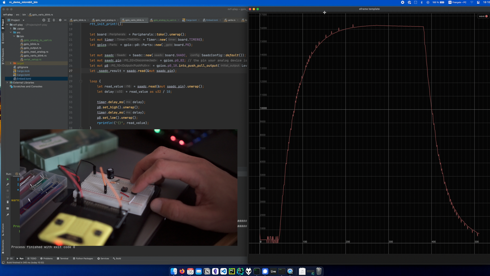

# RC Circuit : microbit::demo

This repository contains two `rust` projects that demonstrate real time serial RC capacitor charge and discharge.

- `./mcu` contains microcontroller program code and can be used to flash the microbit::v2.
- `./gui` contains uart reception and real-time plotting using egui and eframe.

**This is a one rainy sunday project, do not expect quality code 🙃**

## How to use
```
# in ./gui
cargo run --release
# in ./mcu
cargo embed --features v2 --target thumbv7em-none-eabihf
```
See below for software and hardware requirements.

## Video demonstration
A simple breadboard montage with two push buttons for charging and discharging circuit is depicted on the left.  
On the right, the analog DC voltage taken at the capacitor level is plotted in function of time.  
I change the resistor mid-video in order to demonstrate the effect on transient raising time.
<p align="center">
<a href="https://www.youtube.com/watch?v=WmhbGuJmt2Y&ab_channel=AlexIsLouis">
Click here to see the video on YouTube or on the image.

</a>
</p>

## Details
### MCU
The MCU code has two simple purposes :
- Initiate UART serial connection in order to talk to the GUI (tx/rx gpios p0_06, p1_08).
- Configure analog IN GPIO 0 (p0_02).
- Sample analog voltage with [SAADC](https://en.wikipedia.org/wiki/Successive-approximation_ADC) peripheral.
- Convert `i16` readings in `u8` to be sent in UART frames. 
- Loop

I mainly used the HAL Peripherals directly from the microbit crate (not using the Board::board structure). 

### GUI
The GUI code does the following :
- Initiate UART serial connection in order to talk to the MCU ([serialport](https://docs.rs/serialport/%5E4.2.0) crate).
- Read from serial byte stream and convert back to `i16`.
- Keep rolling history of reading and plot in realtime the voltage.

## Hardware (I used)
- microbit::v2 (code specific)
- 470 microF / 16V capacitor
- two switches
- various resistors in order to change transient time constant

## Dependencies
See both `Cargo.toml` as well as [these instructions](https://docs.rust-embedded.org/discovery/microbit/03-setup/index.html) for the mcu part.

## References
- https://github.com/nrf-rs/microbit/
- https://docs.rust-embedded.org/discovery/microbit/index.html